# DSA3101 OCR Frontend Documentation

The OCR part of the frontend application will be hosted on ```http://127.0.0.1:9001/```

The analytics part of the frontend application will be hosted on ```http://127.0.0.1:9001/dashboard```

# Running the application

If the docker compose up fails from the root folder, do change directory (cd) into frontend folder and perform docker compose up to test the frontend alone.
Alternatively, you can view the frontend part of the application at (https://dsa3101-2310-09-ocr.onrender.com/) and (https://dsa3101-2310-09-ocr.onrender.com/dashboard)

## Architecutre of the System

There are a total of 3 containers running in the system.

1.[flask-model](../backend/)

- APIs to retrieve the data output from the prediction model trained by the backend, which return the data from the OCR extraction, CSV transformation and other analytics.

2.[mysql](./init-dump) (Exposed at Port 3306)

- Usage of mysql database that is created upon runtime using [db-script](./init-dump/counter.sql)
- Stores the data that has been recorded in the OCR web application (Form Data - Weight, Timestamp, Image, etc)
- Tables:
	- extraction (collectionTime (PK), binCenterName, extractedWeight, manualWeight, latitude, longtitude, selectedSession, selectedReportingType)
	- images (collectionTime (PK), image)
	- logs (log_time, method, table_name, log_message, log_values)
	- bincenters (binCenterName (PK), binCenterID, binCenterLat, binCenterLon)
	- evrekadb (collectionTime (PK), RFID, binCenterLat, binCenterLon, reportedWeight)

3.[flask-app](./)

- Two parts to the application:
    - OCR: Main application which supports the capturing of images of the truck panel for OCR extraction
    - [Dashboard](./dashboard): Allows for analysis of data that has been captured that has features like filtering, sorting and anomaly detection with ability to export the table as csv

## Files in Detail

### [main.py](main.py)

- Main driver script for the application
- Flask app routes and database connection happens here
- The dashboard part of the application is connected through the routing here

### [app.py](dashboard/app.py)

- Dashboard allowing for analytics
- Here is the main script for the dash application

## Application Descriptions - OCR

### Permissions Popup

- We will first a permission popup when the page loads for the first time asking user to enable location and camera features

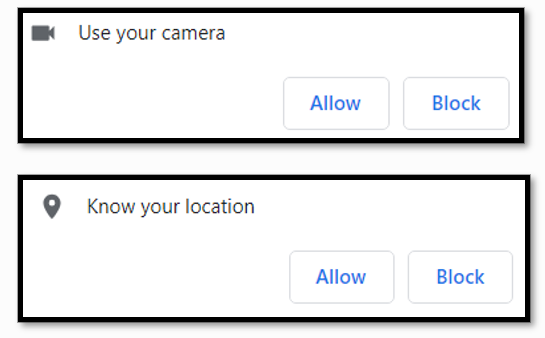

### Instructions Modal

- A modal popup showing how image capture should look like for OCR extraction

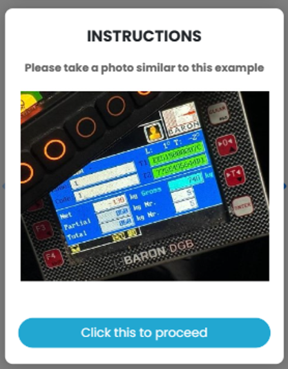

## Single Container

- For ease of data passing and speed, we have designed the following form submission into a single container using [SwiperJS](https://swiperjs.com/)
- We have broken down the whole submission process such that it does not overwhelm the user.

### Session Selection

- After clicking on Proceed, users will choose the session that the data is going to be recorded for as waste collection happens either in Morning or Afternoon, although default is selected based on current timestamp.

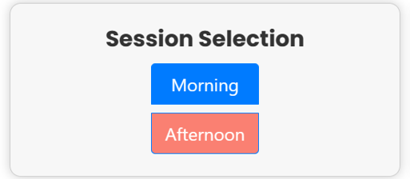

### Reporting Type

- Then, the user can choose to report the form as either Normal or Reference weight since sometimes we need to calculate the corect weight based on taring calculations.
- Context: Waste trucks enter NUS with a base weight (Similar to zero error on weighing scales)

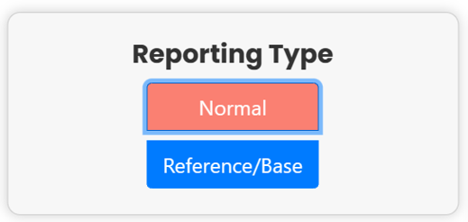

### Capture Page

- Here, users will proceed to take an image of the truck panel. The video feed is automatically started when the user reaches the page
- Red bounding box helps user to align truck panel
- Capture button allowing user to take an image easily

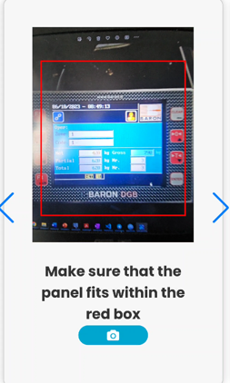

- Supports landscape orientation as well

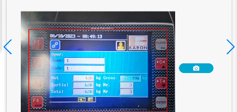

### Confirm Image Page

- User will be able to confirm if the image taken can be sent for processing
- They can also choose to retake an image if they are not satisfied with the taken image, perfecting before sending to backend
- Timestamp is also displayed

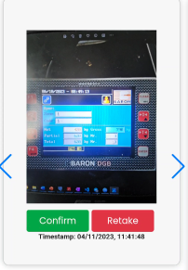


### Bin Center Selection Page

- Ability to select bin center using map toggle or dropdown
- Selected marker is in green, others are in blue
- Dropdown lists bin center names
- Changing in either place will simultaneously change the other method
- 
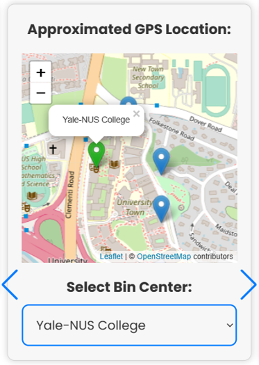

### Confirmation Page

- View all the data that was collected or processed in the form
- If OCR extraction is not right, user can input weight manually
- Click on 'Submit' to submit the form
- Receive popup on sucessful submission
- Record and image are saved in database.

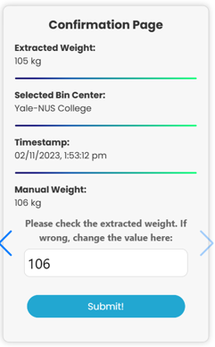

## Application Descriptions - Dashboard

### Homepage - Overview

- This is the default landing page for the user. It consists of 2 interactive and informative portions

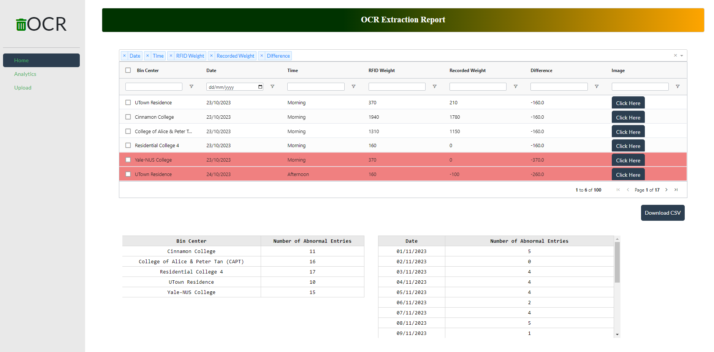

### Homepage - OCR Weight Extraction Data

- Presenation of the processed data from the OCR extraction
- Ability to detect abnormalities in weight detection, which are highlighted in red
- Ability to choose, filter and sort the necessary columns
- Ability to select necessary rows afterwards for exportation to csv
- The admin can manually check and change the values, which will be highlighted in green

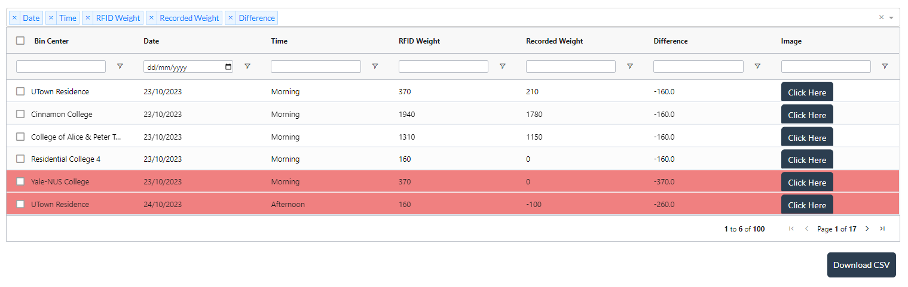

### Homepage - OCR Abnormal Entries Overview

- View all the data which has been flagged as abnormal, based on deviation from RFID weight.

- Simple overview based on Bin Center and Date

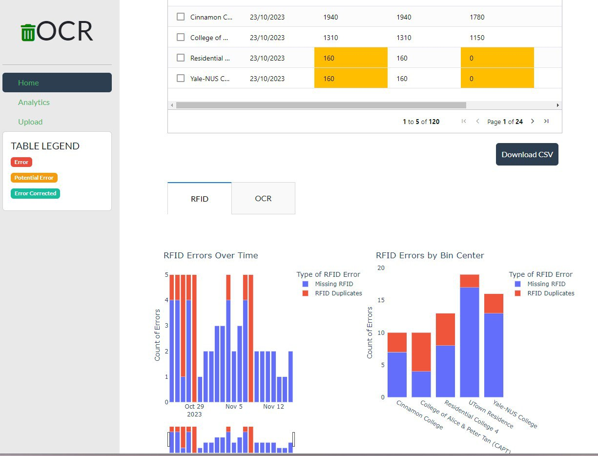

### Analytics

- Map view of the different bin centres

- Ability to filter the type of waste

- Graph to showcase the type of waste based on value

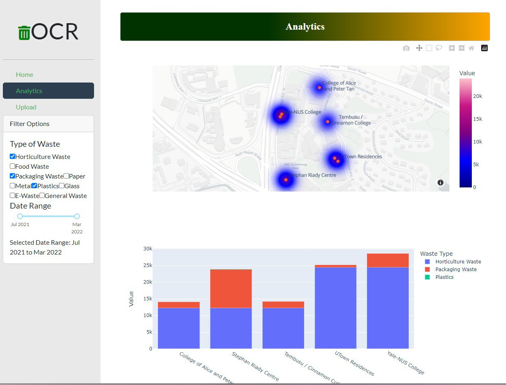

### Upload

- Drag or select files for upload

- Send to backend for processing

- Receive processed data which can be downloaded.

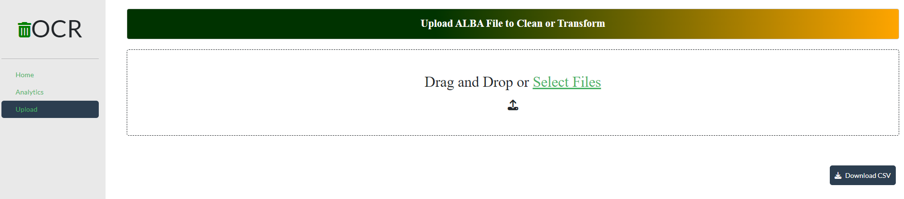

## Authors

- [A Muhammed Madhih](https://github.com/madhih2000)
- [Shonn Tan](https://github.com/ThonnSan)
- [A.Guhanavel S/O Ashok Kumar](https://github.com/guhanavel)
- [Maximus Chin Yu Xun](https://github.com/maximuschin)

